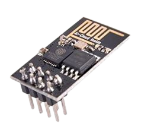
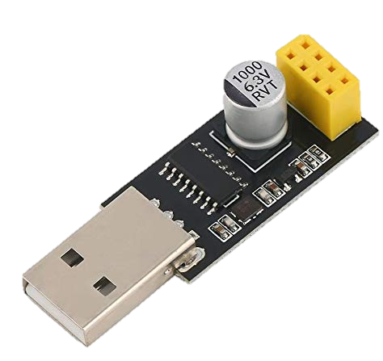
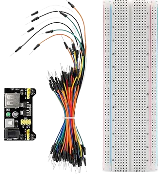
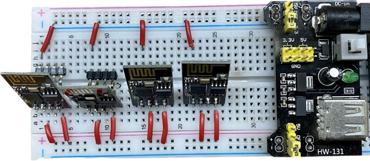
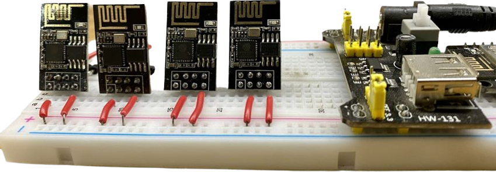

# emulate_wifi_clients
To connect wifi client remotely with gateway for testing purpose

## Hardware Details

|SNo| Description | Hardware 
|---|-------------|----------
|1|[ESP01](https://amzn.eu/d/7bEEflm)|
|2|[ESP01 Flasher](https://amzn.eu/d/b8dwMxA)| 
|3|[BreadBoard + Power supply module](https://amzn.eu/d/cFOHzTH)|
|4| 5 to 12V 1A power Aapter||

## Setup Details
 ESP01 clients (802.11n) are used for remote wifi clients connect test. ESP01 is configured to bootup with AP mode. The enduser setup captive portal is used to configure WiFi credentials to connect as STA. additional Timeout params is added to reset ESP01 as AP again to make it available for testing.

 

### 1. Flash ESP01

you can use the firmware provided in [Firmware](ESP_Tools/nodemcu-release-13-modules-2022-12-18-11-19-47-integer.bin) or you can custome build Node MCU firmware [nodemcu-build](https://nodemcu-build.com/). Enable WiFi manager/captive portal to configure WiFi credentials. The [NodeMCU-PyFlasher](ESP_Tools/NodeMCU-PyFlasher_executable.zip) can be used to flash ESP01 board.

`Update details on how to flash`

update the Accesspoint SSID `ESP_STA_001` for each ESP01 board.

### 2. Upload init.lua

upload the default [init](ESP_Tools/init.lua) program to run in ESP01.

### 3. Upload modified enuser_setup page

using ESPlorer we can upload the [enduser_setup.html.gz](ESP_Tools/enduser_setup.html.gz) into ESP01 board.

The Enduser setup page which is used in captive portal

## Host scripts

1. [scan clients](./scan_clients.sh) - To get the list of ESP01 clients
2. [Configure clients](./configure_clients.sh) - Run this script with SSID, PSK and Timeout (how long to connect to the client).

